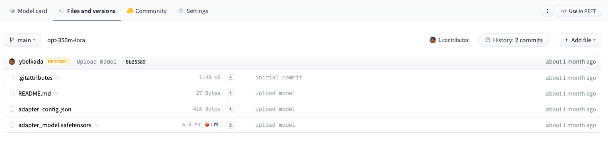

# 快速导览

> 译者：[糖醋鱼](https://github.com/now-101)
>
> 项目地址：<https://huggingface.apachecn.org/docs/peft/quicktour>
>
> 原始地址：<https://huggingface.co/docs/peft/quicktour>


🤗 PEFT提供了用于微调大型预训练模型的参数高效方法。传统范式是针对每个下游任务微调模型的所有参数，但由于当今模型中参数数量庞大，这种方法变得异常昂贵和不切实际。相反，更高效的方法是训练少量提示参数或使用重新参数化方法，如低秩适应（LoRA），以减少可训练参数的数量。

本快速导览将展示🤗 PEFT的主要功能，以及您如何在通常无法使用大模型的消费类设备上进行训练或推理。


## 训练
每种PEFT方法都由一个PeftConfig类定义，该类存储构建PeftModel所需的所有重要参数。例如，要使用LoRA进行训练，加载并创建一个LoraConfig类，并指定以下参数：


- task_type：要进行训练的任务（在本例中为序列到序列语言建模）
- inference_mode：是否将模型用于推断
- r：低秩矩阵的维度
- lora_alpha：低秩矩阵的缩放因子
- lora_dropout：LoRA层的丢弃概率

```python
from peft import LoraConfig, TaskType

peft_config = LoraConfig(task_type=TaskType.SEQ_2_SEQ_LM, inference_mode=False, r=8, lora_alpha=32, lora_dropout=0.1)
```

> 请查看LoraConfig参考文档，了解您可以调整的其他参数的更多详细信息，例如要调整的模块或偏置类型。  

设置好LoraConfig后，使用get_peft_model()函数创建一个PeftModel。该函数接受一个基础模型（您可以从Transformers库中加载），以及包含如何配置模型以在LoRA下进行训练的参数的LoraConfig。

加载您想要微调的基础模型。
```python
from transformers import AutoModelForSeq2SeqLM

model = AutoModelForSeq2SeqLM.from_pretrained("bigscience/mt0-large")
```  
使用get_peft_model()函数将基础模型和peft_config封装起来，创建一个PeftModel。为了了解您模型中可训练参数的数量，可以使用print_trainable_parameters方法。

```python
from peft import get_peft_model

model = get_peft_model(model, peft_config)
model.print_trainable_parameters()

"output: trainable params: 2359296 || all params: 1231940608 || trainable%: 0.19151053100118282"
```
在 bigscience/mt0-large 的 1.2B 参数中，您只训练了其中的 0.19%！

就是这样🎉！ 现在，您可以使用 Transformers Trainer、Accelerate 或任何自定义 PyTorch 训练循环来训练模型。

例如，要使用 Trainer 类进行训练，请使用一些训练超参数设置 TrainingArguments 类。

```python
training_args = TrainingArguments(
    output_dir="your-name/bigscience/mt0-large-lora",
    learning_rate=1e-3,
    per_device_train_batch_size=32,
    per_device_eval_batch_size=32,
    num_train_epochs=2,
    weight_decay=0.01,
    evaluation_strategy="epoch",
    save_strategy="epoch",
    load_best_model_at_end=True,
)
```
将模型、训练参数、数据集、标记器和任何其他必要组件传递给Trainer，并调用train开始训练。
```python
trainer = Trainer(
    model=model,
    args=training_args,
    train_dataset=tokenized_datasets["train"],
    eval_dataset=tokenized_datasets["test"],
    tokenizer=tokenizer,
    data_collator=data_collator,
    compute_metrics=compute_metrics,
)

trainer.train()
```
## 保存模型
在模型训练完成后，您可以使用save_pretrained函数将模型保存到一个目录中。
```python
model.save_pretrained("output_dir")
```
您还可以使用push_to_hub函数将模型保存到Hub（请确保首先登录到您的Hugging Face账户）。
```python
from huggingface_hub import notebook_login

notebook_login()
model.push_to_hub("your-name/bigscience/mt0-large-lora")
```
这两种方法只保存经过训练的额外PEFT权重，这意味着存储、传输和加载都非常高效。例如，这个使用LoRA训练的facebook/opt-350m模型只包含两个文件：adapter_config.json和adapter_model.safetensors。adapter_model.safetensors文件只有6.3MB！




## 推理
> 查看AutoPeftModel API参考，获取可用的所有AutoPeftModel类的完整列表。

使用AutoPeftModel类和from_pretrained方法可以轻松加载任何经过PEFT训练的模型进行推断。

```python
from peft import AutoPeftModelForCausalLM
from transformers import AutoTokenizer
import torch

model = AutoPeftModelForCausalLM.from_pretrained("ybelkada/opt-350m-lora")
tokenizer = AutoTokenizer.from_pretrained("facebook/opt-350m")

model = model.to("cuda")
model.eval()
inputs = tokenizer("Preheat the oven to 350 degrees and place the cookie dough", return_tensors="pt")

outputs = model.generate(input_ids=inputs["input_ids"].to("cuda"), max_new_tokens=50)
print(tokenizer.batch_decode(outputs.detach().cpu().numpy(), skip_special_tokens=True)[0])

"Preheat the oven to 350 degrees and place the cookie dough in the center of the oven. In a large bowl, combine the flour, baking powder, baking soda, salt, and cinnamon. In a separate bowl, combine the egg yolks, sugar, and vanilla."
```
对于其他不被AutoPeftModelFor类明确支持的任务，比如自动语音识别，你仍然可以使用基本的AutoPeftModel类加载适用于该任务的模型。

```python
from peft import AutoPeftModel

model = AutoPeftModel.from_pretrained("smangrul/openai-whisper-large-v2-LORA-colab")
```

## 下一步

现在你已经了解了如何使用PEFT方法之一训练模型，我们鼓励你尝试一些其他方法，比如提示微调。步骤与快速入门中展示的步骤非常相似：

- 1、为PEFT方法准备一个PeftConfig
使用get_peft_model()方法根据配置和基础模型创建一个PeftModel
- 2、然后你可以按照自己的喜好进行训练！要加载用于推断的PEFT模型，可以使用AutoPeftModel类。

如果你有兴趣使用其他PEFT方法针对特定任务训练模型，也可以查看任务指南，如语义分割、多语言自动语音识别、DreamBooth、标记分类等。