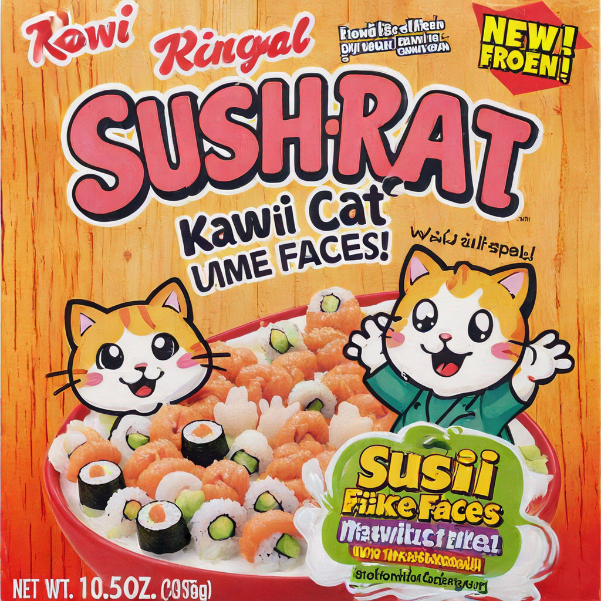

# PEFT集成

> 译者：[糖醋鱼](https://github.com/now-101)
>
> 项目地址：<https://huggingface.apachecn.org/docs/peft/tutorial/peft_integrations>
>
> 原始地址：<https://huggingface.co/docs/peft/tutorial/peft_integrations>
## PEFT集成

PEFT集成
PEFT 的实际优势扩展到了其他Hugging Face库，如 Diffusers 和 Transformers 。PEFT的一个主要优势是，由PEFT方法生成的适配器文件比原始模型要小得多，这使得管理和使用多个适配器变得非常容易。您可以通过简单加载针对您正在解决的任务微调的新适配器，使用一个预训练基础模型来解决多个任务。或者，您可以将多个适配器与文本到图像扩散模型结合起来，以创建新的效果。

本教程将向您展示 PEFT 如何帮助您在 Diffusers 和 Transformers 中管理适配器。

## Diffusers
Diffusers 是一个用于从文本或图像创建图像和视频的生成式人工智能库，其中使用扩散模型。LoRA是扩散模型的一种特别流行的训练方法，因为您可以非常快速地训练和共享扩散模型，以生成新风格的图像。为了更容易地使用和尝试多个 LoRA 模型，Diffusers 使用 PEFT 库来帮助管理不同的适配器以进行推理。

例如，加载一个基础模型，然后使用 `load_lora_weights` 方法加载用于推理的 `artificialguybr/3DRedmond-V1` 适配器。加载方法中的 `adapter_name` 参数由PEFT启用，允许您为适配器设置一个名称，这样更容易引用。

```python
import torch
from diffusers import DiffusionPipeline

pipeline = DiffusionPipeline.from_pretrained(
    "stabilityai/stable-diffusion-xl-base-1.0", torch_dtype=torch.float16
).to("cuda")
pipeline.load_lora_weights(
    "peft-internal-testing/artificialguybr__3DRedmond-V1", 
    weight_name="3DRedmond-3DRenderStyle-3DRenderAF.safetensors", 
    adapter_name="3d"
)
image = pipeline("sushi rolls shaped like kawaii cat faces").images[0]
image
```


现在让我们尝试另一个很酷的 LoRA 模型，名称为 `ostris/super-cereal-sdxl-lora`。您只需要加载并命名这个新的适配器为 `adapter_name`，并使用 `set_adapters` 方法将其设置为当前活动适配器。

```python
pipeline.load_lora_weights(
    "ostris/super-cereal-sdxl-lora", 
    weight_name="cereal_box_sdxl_v1.safetensors", 
    adapter_name="cereal"
)
pipeline.set_adapters("cereal")
image = pipeline("sushi rolls shaped like kawaii cat faces").images[0]
image
```


最后，您可以调用 disable_lora 方法来恢复基础模型。
```python
pipeline.disable_lora()
```
了解有关 PEFT 如何支持 Diffusers 的更多信息，请参阅《使用 PEFT 进行推理》教程。

## Transformers
Transformers 是一个包含各种任务和模态的预训练模型集合。您可以加载这些模型进行训练或推理。许多模型都是大型语言模型（LLMs），因此将 PEFT 与 Transformers 集成以管理和训练适配器是很有意义的。

加载一个基础预训练模型进行训练。
```python
from transformers import AutoModelForCausalLM

model = AutoModelForCausalLM.from_pretrained("facebook/opt-350m")
```
接下来，添加一个适配器配置来指定如何调整模型参数。调用 `add_adapter()` 方法将配置添加到基础模型中。
```python
from peft import LoraConfig

config = LoraConfig(
    lora_alpha=16,
    lora_dropout=0.1,
    r=64,
    bias="none",
    task_type="CAUSAL_LM"
)
model.add_adapter(peft_config)
```
现在您可以使用 Transformer 的 `Trainer` 类或您喜欢的任何训练框架来训练模型。

要将新训练的模型用于推理，`AutoModel` 类在后台使用 PEFT 将适配器权重和配置文件加载到基础预训练模型中。
```python
from transformers import AutoModelForCausalLM

model = AutoModelForCausalLM.from_pretrained("ybelkada/opt-350m-lora")
```
如果您有兴趣比较或使用多个适配器，您也可以调用 `add_adapter()` 方法将适配器配置添加到基础模型中。唯一的要求是适配器类型必须相同（不能混合使用 LoRA 和 LoHa 适配器）。
```python
from transformers import AutoModelForCausalLM
from peft import LoraConfig

model = AutoModelForCausalLM.from_pretrained("facebook/opt-350m")
model.add_adapter(lora_config_1, adapter_name="adapter_1")
```
再次调用 `add_adapter()` 方法将一个新的适配器附加到基础模型。

```py
model.add_adapter(lora_config_2, adapter_name="adapter_2")
```
然后您可以使用 `set_adapter()` 方法来设置当前活动的适配器。
```py
model.set_adapter("adapter_1")
output = model.generate(**inputs)
print(tokenizer.decode(output_disabled[0], skip_special_tokens=True))
```
要禁用适配器，请调用 `disable_adapter()` 方法。
```py
model.disable_adapter()
```
如果您感兴趣，请查看“使用 PEFT 加载和训练适配器”教程，以了解更多信息。
